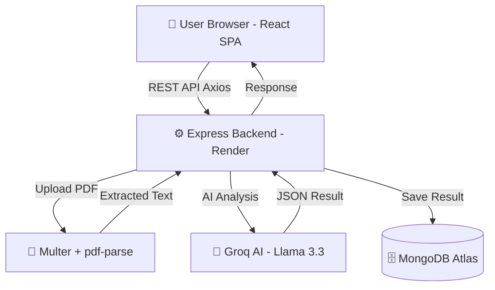
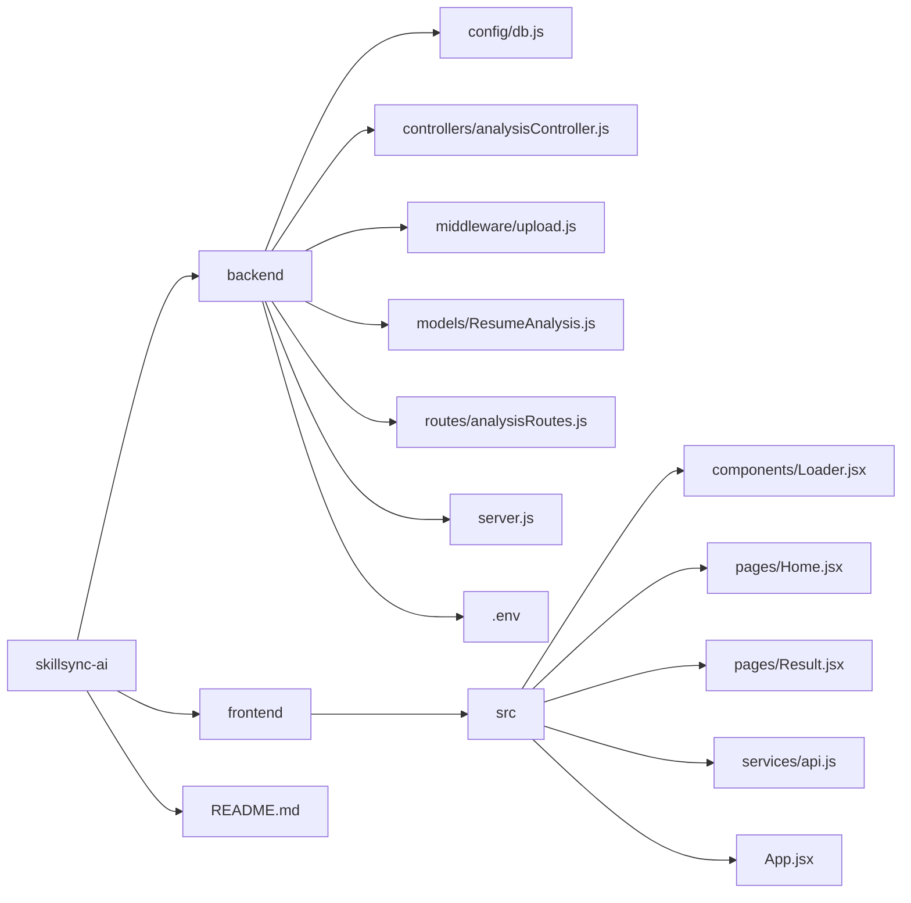

# ⚡ SkillSync AI
### Smart Resume Analyzer & Job Matcher


## 🌐 Live Demo
👉 **https://skillsync-ai-two.vercel.app**

---

## 📋 Table of Contents
- [Overview](#overview)
- [Features](#features)
- [Tech Stack](#tech-stack)
- [Architecture](#architecture)
- [Project Structure](#project-structure)
- [API Reference](#api-reference)
- [Environment Variables](#environment-variables)
- [Running Locally](#running-locally)
- [Deployment](#deployment)

---

## 🔍 Overview
SkillSync AI is a full-stack web application that analyzes your resume and matches it with your desired job role using AI. Upload your PDF resume, enter a job role, and get instant AI-powered insights including match score, skills found, missing skills, and personalized suggestions.

---

## ✨ Features
- 📄 **PDF Resume Upload** — Upload your resume in PDF format
- 🎯 **Match Score** — Get a percentage match with your desired job role
- ✅ **Skills Found** — See which skills you already have
- ❌ **Missing Skills** — Identify skill gaps for the job role
- 💡 **AI Suggestions** — Get personalized improvement tips
- 💾 **MongoDB Storage** — All analyses saved to database
- 📱 **Responsive Design** — Works on mobile and desktop

---

## 🛠 Tech Stack

| Layer | Technology |
|-------|-----------|
| Frontend | React.js 18, React Router v6, Axios |
| Backend | Node.js, Express.js 4 |
| Database | MongoDB Atlas, Mongoose |
| AI | Groq API (Llama 3.3 70B) |
| PDF Parsing | pdf-parse, Multer |
| Deployment | Vercel (Frontend), Render (Backend) |

---
## 🏗 Architecture



## 📁 Project Structure


## 📡 API Reference

### Upload Resume
POST /api/upload-resume
Content-Type: multipart/form-data
Body: { resume: <PDF file> }
Response: { resumeText: "extracted text..." }

### Analyze Resume
POST /api/analyze
Content-Type: application/json
Body: {
"resumeText": "...",
"jobRole": "Backend Developer"
}
Response: {
"match_score": "75%",
"skills_found": ["Node.js", "MongoDB"],
"missing_skills": ["Docker", "Kubernetes"],
"suggestions": ["Learn Docker..."]
}

---

## 🗄 Data Model

### ResumeAnalysis
| Field | Type | Description |
|-------|------|-------------|
| resumeText | String | Extracted PDF text |
| jobRole | String | Target job role |
| matchScore | String | Percentage match |
| skillsFound | [String] | Identified skills |
| missingSkills | [String] | Missing skills |
| suggestions | [String] | AI suggestions |
| createdAt | Date | Timestamp |

---

## 🔐 Environment Variables

### backend/.env
PORT=5000
MONGO_URI=your_mongodb_connection_string
GROQ_API_KEY=your_groq_api_key

### frontend/.env
REACT_APP_API_URL=your_backend_url/api

⚠️ Never commit .env files to version control!

---

## 🚀 Running Locally

### Backend
```bash
cd backend
npm install
npm run dev
```

### Frontend
```bash
cd frontend
npm install
npm start
```

---

## 🌍 Deployment

| Service | Platform | URL |
|---------|----------|-----|
| Frontend | Vercel | https://skillsync-ai-two.vercel.app |
| Backend | Render | https:xxxxxx.onrender.com |
| Database | MongoDB Atlas | Cloud hosted |

---

## 👨‍💻 Author
**Aditya Bhardwaj**
- GitHub: [@Aditya-Bhardwaj-jod](https://github.com/Aditya-Bhardwaj-jod)

---

Built with ❤️ using MongoDB · Express · React · Node.js · Groq AI

